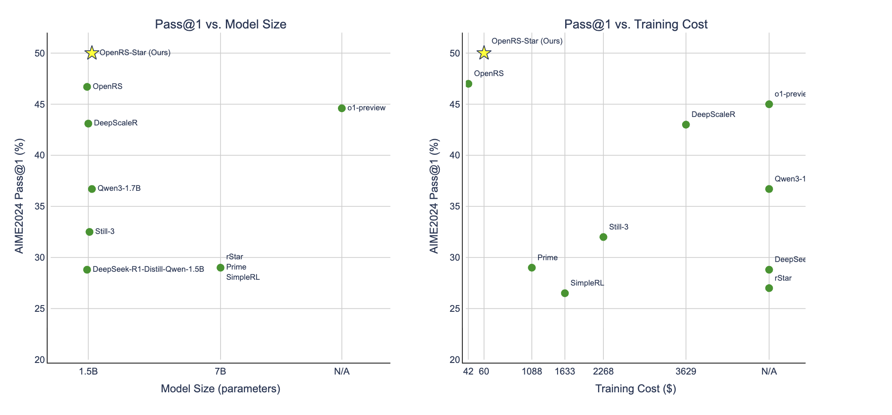
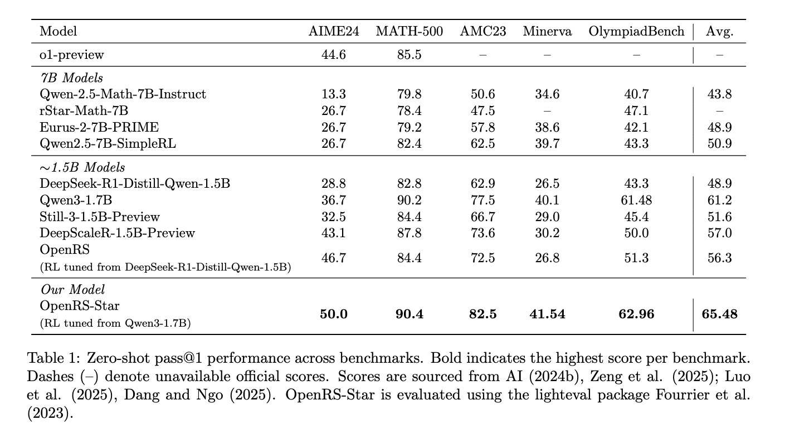

# OpenRS-Star: Multi-Stage Fine-Tuning of Qwen3-1.7B for Mathematical Reasoning

This repository extends the [OpenRS](https://github.com/knoveleng/open-rs), which explores reinforcement learning (RL) for enhancing reasoning in small LLMs under resource-constrained conditions.

We build upon the OpenRS foundation by training  [Qwen3-1.7B](https://huggingface.co/Qwen/Qwen3-1.7B) model using a two-stage curriculum and DAPO-style optimizations. We achieve 50% accuracy on AIME24 — state-of-the-art performance among small reasoning models — with a training budget of under $100.


---

## 🚀 Key Differences from OpenRS

| Feature                      | OpenRS                                |  OpenRS-Star                         |
|-----------------------------|----------------------------------------|--------------------------------------|
| Base model                  | DeepSeek-R1-Distill-Qwen-1.5B          | Qwen3-1.7B                           |
| Context length              | Up to 4k                               | Two-stage: 4k → 8k                   |
| Optimizations               | GRPO                                   | GRPO + DAPO-style improvements       |
| Results (AIME24)            | 46.7%                                  | 50.0%                                |
| Compute budget              | ~$42 (A40s)                            | <$100 (A100s + H200s)                |

---

## Resulting Model
- [OpenRS-Star](https://huggingface.co/oanaflores/OpenRS-Star)


## Dataset
- [open-rs](https://huggingface.co/datasets/knoveleng/open-rs) 


## 🧪 Two-Stage Length Training

This project uses two branches to reflect a multi-stage fine-tuning process:

1. [`qwen3-1.7B-compl-len-4k`](https://github.com/flores-o/open-rs/tree/qwen3-1.7B-compl-len-4k)  
   - Stage 1: 4k completion length  
   - 50 steps on 2x A100 (80GB)  
   - Produces a checkpoint used as input to stage 2

2. [`qwen3-1.7B-compl-len-8k`](https://github.com/flores-o/open-rs/tree/qwen3-1.7B-compl-len-8k)  
   - Stage 2: 8k completion length  
   - 38 steps on 2x H200  
   - Continues training from stage 1 checkpoint

> 📦 The resulting model achieves **50% accuracy on AIME24**, exceeding previous OpenRS runs — at a cost of less than **$100**.

---

## 🔧 [DAPO](https://github.com/BytedTsinghua-SIA/DAPO) Optimizations Applied

We applied several optimizations to improve training stability: Clip-Higher, Pure Accuracy Reward, Masked Rewards, Token-Average Loss, Dynamic Sampling Filter. See Apendix for details.

---

## 📊 Results



---

## 📁 Usage

To replicate this training setup:

- Begin with the [`qwen3-1.7B-compl-len-4k`](https://github.com/flores-o/open-rs/tree/qwen3-1.7B-compl-len-4k) branch
- Save the checkpoint from that run (e.g., `step50`)
- Checkout `qwen3-1.7B-compl-len-8k` and continue training from the saved checkpoint.

---
---


## Installation

### Authentication
Copy .env.template into a new .env file and complete with your github, huggingface and wandb credentials.

### Dependencies
Run installation Script:
```bash
./setup_openrs.sh
```

Activate newly created virtual env.
```
source openr1/bin/activate
```

Update transformers library for using Qwen3 series.
```
pip install --upgrade transformers
```


### Git LFS
Ensure Git LFS is installed for model/dataset management:
```bash
git-lfs --version
```
If not installed:
```bash
sudo apt-get install git-lfs
```


## Training

Set huggingface repo name. This will be used for pushing checkpoints to the huggingface hub.
```
export CKPT_REPO=<your_hf_username>/qwen3-1.7B-compl-len-4k
```

Train models using a YAML config with 2 A100 GPUs:
```bash
 CUDA_VISIBLE_DEVICES=0,1 accelerate launch   --mixed_precision bf16   --config_file recipes/accelerate_configs/zero2.yaml   src/open_r1/grpo.py --config recipes/grpo.yaml
```


## Evaluation

Dependencies for lighteval.

```
pip install "protobuf>=5,<6" --force-reinstall
pip install e2b --upgrade            # gets 1.4.0 again
pip install --no-deps -U lighteval   # leaves the pin unhappy but functional


pip install "e2b-code-interpreter==1.0.5" --no-deps
```


Evaluate models using `lighteval` with custom tasks in `src/open_r1/evaluate.py`. For single-GPU setups:
```bash
MODEL=oanaflores/OpenRS-Star
MODEL_ARGS="pretrained=$MODEL,\
trust_remote_code=True,\
dtype=bfloat16,\
max_model_length=32768,\
gpu_memory_utilization=0.8,\
generation_parameters={max_new_tokens:16384,temperature:0.6,top_p:0.95}"


# Example: AIME 2024
TASK=aime24

lighteval vllm "${MODEL_ARGS}" "custom|${TASK}|0|0" \
  --custom-tasks src/open_r1/evaluate.py \
  --use-chat-template \
  --output-dir "${OUTPUT_DIR}" \
  --save-details

```


## 🤝 Acknowledgements

This project is built on top of [OpenRS](https://github.com/knoveleng/open-rs), with thanks to the authors for open-sourcing their work.

-----

<details>
<summary> <strong>  📎 Appendix: Optimization Details (DAPO) </strong> </summary>


</br>
We apply five optimizations adapted from the DAPO framework ([Zhou et al., 2024](https://arxiv.org/abs/2403.03374)), designed to improve signal quality, training stability, and generalization for reasoning tasks.

### 2.2.1 Clip-Higher (DAPO)

**Problem**: PPO’s symmetric clip only lets any token move ±20% per update. Rare but good tokens lose more often than they win, so their probs drift to zero—entropy crashes.  
**Fix**: Keep the −20% limit but raise the + side to +28%. Occasional wins now offset losses, tail tokens survive, exploration stays alive.

---

### 2.2.2 Pure Accuracy Reward (DAPO)

Extra shaping rewards (format), the model learns to game the tag reward.  
**Fix**: Keep **only** binary accuracy reward ⇒ gradient = correctness, no hacking.

---

### 2.2.3 Reward-Mask on Truncation (DAPO)

Truncated answers still receive a reward, most often negative → noisy gradient.  
**Fix**: For truncated answers, reward 0 (no update).

---

### 2.2.4 Token-Average Loss (DAPO)

**Problem**:  
Sample-mean divides each answer’s loss by its length:  
• 10-token answer ⇒ every token scaled ×1/10 (strong update)  
• 100-token answer ⇒ every token scaled ×1/100 (weak update)  

So short answers dominate training; long reasoning hardly moves the weights.

**Fix**:  
Switch to *token-average*: average over **all tokens** in the batch.  
Every token now has equal weight, so signals inside long correct proofs help just as much—and long wrong rambles are penalized just as strongly—as those in short answers.

---

### 2.2.5 Dynamic Sampling Filter (DAPO)

**Problem**: A prompt whose **G** rollouts are all-correct (1) or all-wrong (0) fills the batch yet adds no learning signal.  
**Fix**: After sampling, if rollouts are all 1 or 0 → **discard prompt & resample**.

</details>


